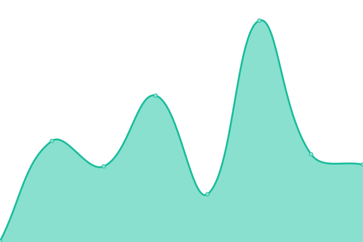

# [📈 Live Status](https://status.hacktj.org): <!--live status--> **🟩 All systems operational**

This repository contains the open-source uptime monitor and status page for [HackTJ](https://hacktj.org), powered by [Upptime](https://github.com/upptime/upptime).

With [Upptime](https://upptime.js.org), you can get your own unlimited and free uptime monitor and status page, powered entirely by a GitHub repository. We use [Issues](https://github.com/HackTJ/status/issues) as incident reports, [Actions](https://github.com/HackTJ/status/actions) as uptime monitors, and [Pages](https://status.hacktj.org) for the status page.

<!--start: status pages-->
<!-- This summary is generated by Upptime (https://github.com/upptime/upptime) -->
<!-- Do not edit this manually, your changes will be overwritten -->
<!-- prettier-ignore -->
| URL | Status | History | Response Time | Uptime |
| --- | ------ | ------- | ------------- | ------ |
|  [HackTJ](https://hacktj.org) | 🟩 Up | [hack-tj.yml](https://github.com/HackTJ/status/commits/HEAD/history/hack-tj.yml) | 

 202ms
     
 | 

<a href="https://status.hacktj.org/history/hack-tj">100.00%</a>
    

|  [HackTJ 11.0](https://hacktj.org/2024) | 🟩 Up | [hack-tj-11-0.yml](https://github.com/HackTJ/status/commits/HEAD/history/hack-tj-11-0.yml) | 

 3608ms
     
 | 

<a href="https://status.hacktj.org/history/hack-tj-11-0">99.57%</a>
    

|  [HackTJ 10.0](https://hacktj.org/2023) | 🟩 Up | [hack-tj-10-0.yml](https://github.com/HackTJ/status/commits/HEAD/history/hack-tj-10-0.yml) | 

 236ms
     
 | 

<a href="https://status.hacktj.org/history/hack-tj-10-0">100.00%</a>
    

|  [HackTJ 9.0](https://hacktj.org/2022) | 🟩 Up | [hack-tj-9-0.yml](https://github.com/HackTJ/status/commits/HEAD/history/hack-tj-9-0.yml) | 

 227ms
     
 | 

<a href="https://status.hacktj.org/history/hack-tj-9-0">100.00%</a>
    

|  [HackTJ 8.0](https://hacktj.org/2021) | 🟩 Up | [hack-tj-8-0.yml](https://github.com/HackTJ/status/commits/HEAD/history/hack-tj-8-0.yml) | 

 259ms
     
 | 

<a href="https://status.hacktj.org/history/hack-tj-8-0">100.00%</a>
    

|  [HackTJ 7.5](https://hacktj.org/2020v2) | 🟩 Up | [hack-tj-7-5.yml](https://github.com/HackTJ/status/commits/HEAD/history/hack-tj-7-5.yml) | 

 1944ms
     
 | 

<a href="https://status.hacktj.org/history/hack-tj-7-5">99.60%</a>
    

|  [HackTJ 7.0](https://hacktj.org/2020) | 🟩 Up | [hack-tj-7-0.yml](https://github.com/HackTJ/status/commits/HEAD/history/hack-tj-7-0.yml) | 

 241ms
     
 | 

<a href="https://status.hacktj.org/history/hack-tj-7-0">100.00%</a>
    

|  [HackTJ 6.0](https://hacktj.org/2019) | 🟩 Up | [hack-tj-6-0.yml](https://github.com/HackTJ/status/commits/HEAD/history/hack-tj-6-0.yml) | 

 256ms
     
 | 

<a href="https://status.hacktj.org/history/hack-tj-6-0">100.00%</a>
    

|  [HackTJ 5.0](https://hacktj.org/2018) | 🟩 Up | [hack-tj-5-0.yml](https://github.com/HackTJ/status/commits/HEAD/history/hack-tj-5-0.yml) | 

 233ms
     
 | 

<a href="https://status.hacktj.org/history/hack-tj-5-0">100.00%</a>
    

|  [HackTJ 4.0](https://hacktj.org/2017) | 🟩 Up | [hack-tj-4-0.yml](https://github.com/HackTJ/status/commits/HEAD/history/hack-tj-4-0.yml) | 

 206ms
     
 | 

<a href="https://status.hacktj.org/history/hack-tj-4-0">100.00%</a>
    

|  [HackTJ 3.0](https://hacktj.org/2016) | 🟩 Up | [hack-tj-3-0.yml](https://github.com/HackTJ/status/commits/HEAD/history/hack-tj-3-0.yml) | 

 233ms
     
 | 

<a href="https://status.hacktj.org/history/hack-tj-3-0">100.00%</a>
    

|  [HackTJ 2.0](https://hacktj.org/2015) | 🟩 Up | [hack-tj-2-0.yml](https://github.com/HackTJ/status/commits/HEAD/history/hack-tj-2-0.yml) | 

 234ms
     
 | 

<a href="https://status.hacktj.org/history/hack-tj-2-0">100.00%</a>
    

<!--end: status pages-->

[**Visit our status website →**](https://status.hacktj.org)

## 📄 License

- Powered by: [Upptime](https://github.com/upptime/upptime)
- Code: [MIT](./LICENSE) © [HackTJ](https://hacktj.org)
- Data in the `./history` directory: [Open Database License](https://opendatacommons.org/licenses/odbl/1-0/)
